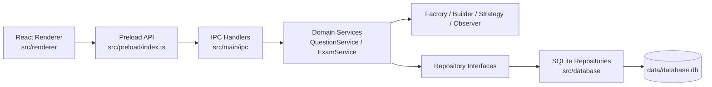
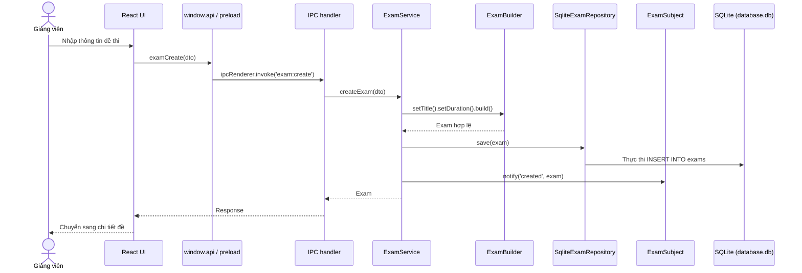
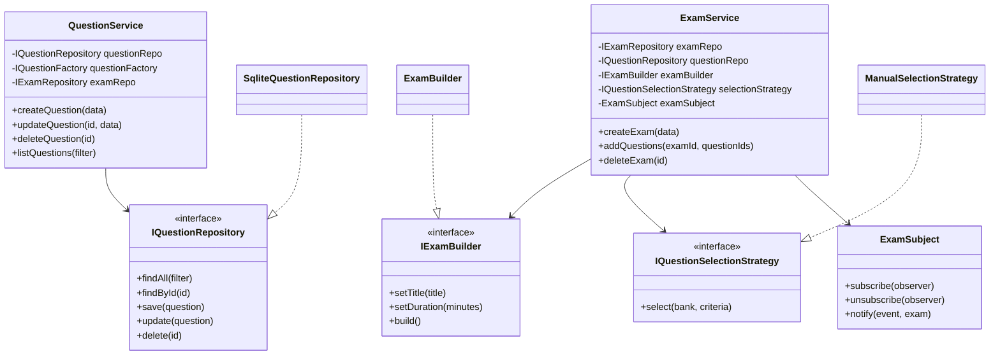

# Báo cáo bài tập lớn môn Phát triển ứng dụng

**Học phần:** AC3030 - Phát triển ứng dụng  
**Tên đề tài:** Ứng dụng tạo đề trắc nghiệm - Quiz Exam Generator  
**Nhóm:** 6  
**Học kỳ:** 2025.2  
**Ngày nộp:** 23/06/2026  

---

## 0. Mục tiêu của báo cáo

Báo cáo này được cấu trúc nhằm giúp giảng viên nhanh chóng trả lời các câu hỏi đánh giá cốt lõi:
1. **Giải quyết đúng vấn đề:** Ứng dụng Quiz Exam Generator giải quyết triệt để nhu cầu quản lý ngân hàng câu hỏi trắc nghiệm và tổ chức đề thi của giảng viên.
2. **Khả năng triển khai:** Ứng dụng chạy độc lập, tự động khởi tạo cơ sở dữ liệu SQLite cục bộ mà không đòi hỏi giảng viên phải cấu hình hệ quản trị cơ sở dữ liệu ngoài.
3. **Kiến trúc rõ ràng:** Tuân thủ mô hình phân lớp Clean Architecture, phân định rõ ràng ranh giới giữa Electron Main/Preload/Renderer và Domain.
4. **Áp dụng Design Patterns:** Tích hợp có chủ đích 4 mẫu thiết kế GoF: Factory Method, Builder, Strategy và Observer.
5. **Tuân thủ nguyên tắc SOLID:** Thể hiện rõ nét qua các minh chứng cụ thể về SRP, OCP, và DIP trong mã nguồn.
6. **Kiểm thử tự động:** Tập trung kiểm thử lớp Domain/Service và lớp tích hợp Database với tổng cộng 52 ca kiểm thử tự động, đạt tỉ lệ bao phủ (coverage) trên 95%.
7. **Hồ sơ đầy đủ:** Bao gồm mã nguồn sạch, tài liệu hướng dẫn README, dữ liệu mẫu SQLite tự sinh và báo cáo chi tiết.

---

## 1. Thông tin chung của đề tài

### 1.1. Tên đề tài

- **Tên tiếng Việt:** Ứng dụng tạo đề trắc nghiệm.
- **Tên tiếng Anh:** Quiz Exam Generator.
- **Loại ứng dụng:** Desktop application.
- **Công nghệ sử dụng:**
  - **Ngôn ngữ lập trình:** TypeScript.
  - **Framework/thư viện chính:** Electron, React, Vite, electron-vite.
  - **Cơ sở dữ liệu:** SQLite (sử dụng thư viện native `better-sqlite3`).
  - **Công cụ test:** Vitest, V8 coverage.
  - **Công cụ build/deploy:** npm, electron-vite.

### 1.2. Thông tin nhóm

| STT | Họ và tên       | MSSV     | Vai trò chính                             | Module phụ trách                                                                              | Unit test phụ trách            | Ghi chú                                                       |
| --: | --------------- | -------- | ----------------------------------------- | --------------------------------------------------------------------------------------------- | ------------------------------ | ------------------------------------------------------------- |
|   1 | Lê Thanh Thảo   | 20231631 | UI / Renderer + Strategy Pattern          | React Pages, Components, Electron Preload, `ManualSelectionStrategy`                          | TC11-TC15 (Strategy)           | Phụ trách trải nghiệm người dùng và luồng chọn câu hỏi        |
|   2 | Nguyễn Văn Mạnh | 20231609 | Domain / Factory Method Pattern           | `Question`/`Exam` entities, `QuestionFactory`, `IQuestionFactory`                             | TC01-TC05 (Factory)            | Phụ trách mô hình dữ liệu và tạo câu hỏi hợp lệ               |
|   3 | Trương Văn Thái | 20231627 | Database / Builder Pattern + Config | `SqliteDatabase`, `SqliteQuestionRepository`, `SqliteExamRepository`, `ExamBuilder`, IPC      | TC06-TC10 (Builder)            | Phụ trách lưu trữ SQLite, cấu hình build và wiring            |
|   4 | Tống Nhật Huy   | 20231595 | Observer Pattern + Service layer + SOLID  | `ExamSubject`, `ExamListObserver`, `ExamService`, `QuestionService`, `serviceFactory`         | TC16-TC25 (Observer + Service) | Phụ trách service, observer, review SOLID và kiểm thử mở rộng |

### 1.3. Link và file nộp kèm

| Loại minh chứng  | Tên file/link                                     | Ghi chú                                                                                        |
| ---------------- | ------------------------------------------------- | ---------------------------------------------------------------------------------------------- |
| Báo cáo chính    | `Report_NhomAC30_QuizExamGenerator.md`            | File báo cáo Markdown hiện tại                                                                 |
| Mã nguồn         | Thư mục project `btl_app/` hoặc file zip khi nộp | Không nộp `node_modules/`, `.tsbuild/`, file tạm                                               |
| README           | `README.md`                                       | Có hướng dẫn chạy app, build, test, coverage                                                   |
| Dữ liệu demo     | `data/database.db`                                | Cơ sở dữ liệu SQLite tự động khởi tạo khi app chạy                                             |
| Kết quả coverage | `coverage/lcov-report/index.html`                 | Sinh bởi `npm run test:coverage`                                                               |
| Bản build        | `out/main/`, `out/preload/`, `out/renderer/`      | Sinh bởi `npm run build`                                                                       |

---

## 2. Tóm tắt vấn đề và giải pháp

### 2.1. Bối cảnh bài toán
Giảng viên thường phải quản lý ngân hàng câu hỏi trắc nghiệm, chọn câu hỏi theo chủ đề/độ khó và tạo đề thi thủ công. Cách làm bằng file văn bản hoặc bảng tính dễ gây trùng lặp, khó kiểm soát đáp án đúng và khó tái sử dụng câu hỏi giữa nhiều đề thi.

Ứng dụng Quiz Exam Generator giải quyết vấn đề này bằng một phần mềm desktop chạy trên Electron. Giảng viên có thể quản lý ngân hàng câu hỏi, tạo đề thi, thêm câu hỏi vào đề, lọc câu hỏi, xem lại danh sách đề thi đã tạo và xem thông tin nhóm phát triển ngay trong chương trình.

### 2.2. Mục tiêu của ứng dụng
1. Quản lý ngân hàng câu hỏi trắc nghiệm theo nội dung, 4 đáp án, đáp án đúng, độ khó và chủ đề.
2. Cho phép tạo đề thi với tên đề, mô tả, thời gian làm bài và mức độ.
3. Cho phép chọn thủ công nhiều câu hỏi từ ngân hàng để đưa vào đề thi.
4. Ngăn chặn việc xóa câu hỏi nếu câu hỏi đó đang thuộc một đề thi nào đó.
5. Tách rõ UI, service, domain, repository để dễ kiểm thử và bảo trì.
6. Minh chứng áp dụng design pattern, SOLID và unit test ở domain/service layer.

### 2.3. Phạm vi chức năng

#### Chức năng đã triển khai

| STT | Chức năng                                | Người dùng liên quan | Trạng thái | Minh chứng mã nguồn                                                          |
| --: | ---------------------------------------- | -------------------- | ---------- | ---------------------------------------------------------------------------- |
|   1 | Xem danh sách câu hỏi                    | Giảng viên           | Hoàn thành | `src/renderer/pages/QuestionBankPage.tsx`, `QuestionService.listQuestions()` |
|   2 | Thêm câu hỏi trắc nghiệm                 | Giảng viên           | Hoàn thành | `QuestionFormModal.tsx`, `QuestionFactory.create()`                          |
|   3 | Cập nhật câu hỏi                         | Giảng viên           | Hoàn thành | `QuestionService.updateQuestion()`                                           |
|   4 | Xóa câu hỏi                              | Giảng viên           | Hoàn thành | `QuestionService.deleteQuestion()`                                           |
|   5 | Chặn xóa câu hỏi đang được dùng trong đề | Giảng viên           | Hoàn thành | `QuestionService.deleteQuestion()`, test trong `QuestionService.test.ts`     |
|   6 | Lọc câu hỏi theo độ khó/chủ đề           | Giảng viên           | Hoàn thành | `FilterBar.tsx`, `SqliteQuestionRepository.findAll()`                        |
|   7 | Tạo đề thi                               | Giảng viên           | Hoàn thành | `CreateExamPage.tsx`, `ExamService.createExam()`, `ExamBuilder`              |
|   8 | Xem danh sách đề thi                     | Giảng viên           | Hoàn thành | `ExamListPage.tsx`, `ExamService.listExams()`                                |
|   9 | Xem chi tiết đề thi                      | Giảng viên           | Hoàn thành | `ExamDetailPage.tsx`, `ExamService.getExam()`                                |
|  10 | Thêm nhiều câu hỏi vào đề thi            | Giảng viên           | Hoàn thành | `ExamService.addQuestions()`, `ManualSelectionStrategy.select()`             |
|  11 | Xóa đề thi                               | Giảng viên           | Hoàn thành | `ExamService.deleteExam()`, `ExamSubject.notify('deleted')`                  |
|  12 | Màn hình Thông tin nhóm (Info/About)     | Giảng viên           | Hoàn thành | `src/renderer/pages/InfoPage.tsx`                                            |
|  13 | Nút thoát ứng dụng (Quit/Exit)           | Giảng viên           | Hoàn thành | `App.tsx`, `src/preload/index.ts`, `src/main/index.ts`                       |
|  14 | Bộ đóng gói cài đặt Installer & Portable  | Giảng viên           | Hoàn thành | `package.json` (phần cấu hình `build` và script `dist`)                      |

#### Chức năng ngoài phạm vi hoặc chưa hoàn thiện

| STT | Chức năng chưa làm                      | Lý do                                                                             |
| --: | --------------------------------------- | --------------------------------------------------------------------------------- |
|   1 | Tạo đề tự động theo tỷ lệ chủ đề/độ khó | Đã chuẩn bị bằng Strategy Pattern nhưng hiện mới có `ManualSelectionStrategy`     |
|   2 | Xuất đề thi ra PDF/Word                 | Chưa thuộc phạm vi MVP                                                            |
|   3 | Đăng nhập/phân quyền                    | Ứng dụng hiện phục vụ một nhóm người dùng chính là giảng viên                     |

---

## 3. Yêu cầu bắt buộc về demo và deploy

### 3.1. Ứng dụng phải chạy được trên máy giảng viên

Ứng dụng chạy trực tiếp bằng cách khởi động môi trường development hoặc thực thi bản build. 

Các lệnh đã kiểm tra chạy tốt trên máy:
```bash
npm install          # Cài đặt dependency
npm run typecheck    # Kiểm tra kiểu TypeScript không lỗi
npm test             # Chạy toàn bộ 52 test cases
npm run build        # Build ứng dụng sang out/
npm run dev          # Khởi động ứng dụng
```

### 3.2. File deploy/cài đặt cần có

Sau khi build bằng `npm run build`, các file đầu ra nằm trong thư mục `out/` sẵn sàng chạy:
* `out/main/index.js` (Main process)
* `out/preload/index.js` (Preload API)
* `out/renderer/index.html` (Giao diện React tĩnh)

Dữ liệu của ứng dụng được quản lý cục bộ trong file SQLite:
* `data/database.db` (Được tự động khởi tạo và chạy ngầm cùng chương trình).

### 3.3. Dữ liệu demo bắt buộc

* **Tài khoản demo:** Không có (Ứng dụng sử dụng offline không cần đăng nhập).
* **Dữ liệu mẫu:** Ứng dụng chạy lần đầu sẽ khởi tạo một cơ sở dữ liệu trống hoàn chỉnh. Giảng viên có thể thêm nhanh 5-10 câu hỏi để trải nghiệm đầy đủ tính năng.
* **Kịch bản demo nhanh 5 phút:**
  1. Mở ứng dụng bằng `npm run dev`.
  2. Vào màn hình **Thông tin nhóm** để kiểm tra thông tin thành viên và môn học.
  3. Mở **Ngân hàng câu hỏi**, tạo mới 3 câu hỏi trắc nghiệm thuộc chủ đề "Lịch sử" và "Địa lý".
  4. Thử tìm kiếm và lọc câu hỏi vừa tạo theo độ khó.
  5. Chuyển sang **Quản lý đề thi**, tạo một đề thi mới thời gian 45 phút.
  6. Vào chi tiết đề thi vừa tạo, bấm chọn và thêm các câu hỏi từ ngân hàng vào đề thi.
  7. Quay lại **Ngân hàng câu hỏi**, thử xóa một câu hỏi đã đưa vào đề thi để kiểm tra tính năng chặn xóa.
  8. Bấm **Thoát ứng dụng** ở chân sidebar để đóng app.

### 3.4. Các lỗi thường gặp cần tránh

* **Hard-code đường dẫn tuyệt đối:** Đã tránh hoàn toàn bằng việc dùng `app.getPath` và `process.cwd()` kết hợp `path.join` để tự động xác định thư mục `data/` chứa cơ sở dữ liệu trên mọi hệ điều hành.
* **Database không tồn tại:** Ứng dụng tự động kiểm tra sự tồn tại của thư mục và tệp cơ sở dữ liệu SQLite, tự động chạy câu lệnh SQL khởi tạo cấu trúc bảng nếu tệp `.db` chưa tồn tại.

---

## 4. Menu và màn hình bắt buộc trong chương trình

Ứng dụng thiết kế thanh sidebar điều hướng chính nằm ở bên trái giao diện chương trình, đảm bảo đáp ứng đầy đủ yêu cầu:
1. **Quit/Exit:** Nút **Thoát ứng dụng** màu đỏ nổi bật ở dưới cùng sidebar.
2. **Info/About:** Trang **Thông tin nhóm** hiển thị chi tiết thông tin học phần và nhóm phát triển.

### 4.1. Nội dung màn hình Info/About

Màn hình hiển thị đầy đủ thông tin:
* **Tên môn học:** `AC3030 – Phát triển ứng dụng`
* **Học kỳ:** 2025.2
* **Đề tài:** Quiz Exam Generator - Ứng dụng tạo đề trắc nghiệm
* **Tên nhóm:** Nhóm 6
* **Danh sách thành viên:**
  * Lê Thanh Thảo (MSSV: 20231631) - UI / Renderer + Strategy
  * Nguyễn Văn Mạnh (MSSV: 20231609) - Domain / Factory Method
  * Trương Văn Thái (MSSV: 20231627) - Database / Builder + Config
  * Tống Nhật Huy (MSSV: 20231595) - Observer + Service + SOLID
* **Phiên bản:** 1.0.0

### 4.2. Minh chứng trong báo cáo

* Mã nguồn cấu trúc sidebar và nút thoát: [App.tsx](file:///c:/Users/Hunt/Documents/js/Cu%E1%BB%91i%20k%C3%AC/btl_app/src/renderer/App.tsx)
* Mã nguồn trang thông tin: [InfoPage.tsx](file:///c:/Users/Hunt/Documents/js/Cu%E1%BB%91i%20k%C3%AC/btl_app/src/renderer/pages/InfoPage.tsx)

---

## 5. Phân tích yêu cầu và thiết kế chức năng

### 5.1. Tác nhân/người dùng

| STT | Tác nhân   | Mô tả                                         | Quyền/chức năng chính                                           |
| --: | ---------- | --------------------------------------------- | --------------------------------------------------------------- |
|   1 | Giảng viên | Người quản lý ngân hàng câu hỏi và tạo đề thi | CRUD câu hỏi, tạo/xóa đề, thêm câu hỏi vào đề, xem danh sách đề |

### 5.2. Use case chính

| ID   | Use case                        | Tác nhân   | Mức ưu tiên | Trạng thái |
| ---- | ------------------------------- | ---------- | ----------- | ---------- |
| UC01 | Quản lý ngân hàng câu hỏi       | Giảng viên | Cao         | Hoàn thành |
| UC02 | Lọc/tìm kiếm câu hỏi            | Giảng viên | Trung bình  | Hoàn thành |
| UC03 | Tạo đề thi mới                  | Giảng viên | Cao         | Hoàn thành |
| UC04 | Thêm câu hỏi vào đề thi         | Giảng viên | Cao         | Hoàn thành |
| UC05 | Xem chi tiết đề thi             | Giảng viên | Cao         | Hoàn thành |
| UC06 | Xóa đề thi                      | Giảng viên | Trung bình  | Hoàn thành |
| UC07 | Chặn xóa câu hỏi đang được dùng | Giảng viên | Cao         | Hoàn thành |

### 5.3. Luồng nghiệp vụ chính

#### Luồng 1: Tạo câu hỏi
1. Giảng viên mở màn hình **Ngân hàng câu hỏi** và chọn thêm câu hỏi.
2. Nhập nội dung câu hỏi, 4 đáp án, chỉ định đáp án đúng, độ khó và chủ đề.
3. Renderer gửi yêu cầu `window.api.questionCreate(dto)`.
4. IPC handler nhận sự kiện gọi `QuestionService.createQuestion(dto)`.
5. `QuestionFactory.create()` thực hiện kiểm tra tính hợp lệ dữ liệu và tạo object entity Question.
6. [SqliteQuestionRepository](file:///c:/Users/Hunt/Documents/js/Cu%E1%BB%91i%20k%C3%AC/btl_app/src/database/SqliteQuestionRepository.ts) thực thi TRANSACTION chèn câu hỏi vào bảng `questions` và các phương án trả lời vào bảng `question_options`.
7. UI hiển thị thông báo thành công và cập nhật lại danh sách câu hỏi.

#### Luồng 2: Tạo đề thi
1. Giảng viên mở màn hình **Quản lý đề thi** và chọn tạo đề mới.
2. Giảng viên nhập tên đề, mô tả, thời gian làm bài và độ khó.
3. Renderer gọi `window.api.examCreate(dto)`.
4. `ExamService.createExam()` dùng `ExamBuilder` để xây dựng và validate đối tượng đề thi `Exam`.
5. [SqliteExamRepository](file:///c:/Users/Hunt/Documents/js/Cu%E1%BB%91i%20k%C3%AC/btl_app/src/database/SqliteExamRepository.ts) ghi thông tin đề thi vào bảng `exams`.
6. `ExamSubject.notify('created', exam)` phát đi thông báo sự kiện cho các observer liên quan (như `ExamListObserver`) để đồng bộ cache/danh sách hiển thị.

#### Luồng 3: Thêm câu hỏi vào đề thi
1. Giảng viên mở chi tiết đề thi.
2. Hệ thống tải lên danh sách các câu hỏi chưa được thêm vào đề thi này.
3. Giảng viên chọn các câu hỏi muốn thêm và xác nhận.
4. Renderer gọi `window.api.examAddQuestions(examId, questionIds)`.
5. `ExamService.addQuestions()` lấy danh sách câu hỏi từ database, dùng `ManualSelectionStrategy` để lọc câu hỏi theo ID được chọn.
6. Service kiểm tra nghiệp vụ chặn trùng câu hỏi và gọi `SqliteExamRepository.update()` để chèn các liên kết mới vào bảng trung gian `exam_questions`.

#### Luồng 4: Thoát ứng dụng
1. Giảng viên bấm nút **Thoát ứng dụng** trên sidebar điều hướng.
2. Hệ thống hiển thị hộp thoại xác nhận.
3. Nếu đồng ý, Renderer gọi `window.api.appQuit()`.
4. Preload gửi tín hiệu IPC `app:quit` đến Main process.
5. Main process bắt sự kiện và gọi `app.quit()` để đóng ứng dụng an toàn.

#### Ngoại lệ nghiệp vụ

| Mã lỗi | Tình huống                          | Cách xử lý                                       |
| ------ | ----------------------------------- | ------------------------------------------------ |
| E01    | Nội dung câu hỏi rỗng               | `QuestionFactory` throw lỗi, UI hiển thị message |
| E02    | Câu hỏi không đủ đúng 4 đáp án      | `QuestionFactory` từ chối dữ liệu                |
| E03    | Chỉ số đáp án đúng không hợp lệ     | Factory/service throw lỗi                        |
| E04    | Tên đề thi rỗng                     | `ExamBuilder.build()` throw lỗi                  |
| E05    | Thời gian làm bài <= 0              | `ExamBuilder.build()` throw lỗi                  |
| E06    | Thêm ID câu hỏi không tồn tại       | `ManualSelectionStrategy.select()` throw lỗi     |
| E07    | Thêm câu hỏi đã có trong đề         | `ExamService.addQuestions()` throw lỗi           |
| E08    | Xóa câu hỏi đang được dùng trong đề | `QuestionService.deleteQuestion()` chặn xóa      |

---

## 6. Kiến trúc ứng dụng

### 6.1. Kiến trúc tổng thể

Dự án áp dụng kiến trúc phân lớp hướng **Clean Architecture**:
* **Renderer/UI layer:** Thành phần giao diện React components trong `src/renderer`.
* **Preload/IPC layer:** Trung gian kết nối an toàn `src/preload/index.ts` và `src/main/ipc/*Handlers.ts`.
* **Domain/service layer:** Định nghĩa entities, repository interfaces và business services trong `src/domain`.
* **Pattern layer:** Các thư mục design patterns (`src/patterns`).
* **Database layer:** Triển khai truy cập dữ liệu SQLite thông qua `better-sqlite3` nằm trong `src/database`.

Thiết kế này đảm bảo tách biệt các mối quan tâm (separation of concerns). Domain layer hoàn toàn độc lập với công nghệ lưu trữ (SQLite) và thư viện UI (React), cho phép chạy thử nghiệm unit test cực nhanh và dễ dàng thay thế database.

### 6.2. Sơ đồ kiến trúc



### 6.3. Trách nhiệm từng layer/module

| Layer/Module    | Trách nhiệm                                          | Không nên làm                                                 | Ví dụ file/lớp                                                             |
| --------------- | ---------------------------------------------------- | ------------------------------------------------------------- | -------------------------------------------------------------------------- |
| UI/Presentation | Hiển thị dữ liệu, nhận input, gọi `window.api`       | Không đọc/ghi file trực tiếp, không chứa rule nghiệp vụ chính | `QuestionBankPage.tsx`, `InfoPage.tsx`                                     |
| Preload/IPC     | Cầu nối an toàn giữa renderer và main process        | Không validate nghiệp vụ phức tạp                             | `src/preload/index.ts`, `questionHandlers.ts`, `examHandlers.ts`           |
| Domain/Service  | Điều phối các use case, kiểm tra nghiệp vụ           | Không phụ thuộc React UI hoặc SQLite cụ thể                   | `QuestionService.ts`, `ExamService.ts`                                     |
| Domain Entity   | Định nghĩa cấu trúc dữ liệu cốt lõi                  | Không xử lý lưu trữ hay tương tác giao diện                   | `Question.ts`, `Exam.ts`                                                   |
| Patterns        | Triển khai các GoF pattern độc lập                   | Không chứa code giao diện                                     | `QuestionFactory`, `ExamBuilder`, `ManualSelectionStrategy`, `ExamSubject` |
| Database  | Đọc/ghi cơ sở dữ liệu SQLite                         | Không chứa rule nghiệp vụ chính                               | `SqliteDatabase.ts`, `SqliteQuestionRepository.ts`                         |
| Test            | Kiểm tra nghiệp vụ bằng mock in-memory repositories  | Không gọi IPC/Electron process                                | `src/tests/**/*.test.ts`                                                   |

### 6.4. Luồng xử lý tiêu biểu



---

## 7. Thiết kế lớp/module và minh chứng SOLID

### 7.1. Biểu đồ lớp trích đoạn



### 7.2. SRP - Single Responsibility Principle

| Lớp/Module               | Trách nhiệm chính                     | Trách nhiệm đã tách ra lớp/module khác                              | Vì sao thể hiện SRP?                               |
| ------------------------ | ------------------------------------- | ------------------------------------------------------------------- | -------------------------------------------------- |
| `QuestionService`        | Điều phối nghiệp vụ câu hỏi           | Tạo object do `QuestionFactory`, lưu trữ do repository              | Service chỉ xử lý use case câu hỏi                 |
| `ExamService`            | Điều phối nghiệp vụ đề thi            | Build đề do `ExamBuilder`, chọn câu do Strategy, notify do Observer | Service không ôm logic khởi tạo/chọn câu/thông báo |
| `QuestionFactory`        | Tạo `Question` hợp lệ                 | Không lưu repository, không tương tác với UI                        | Chỉ có một lý do thay đổi: rule tạo câu hỏi        |
| `ExamBuilder`            | Tạo `Exam` theo từng bước và validate | Không lưu cơ sở dữ liệu, không gọi UI                               | Chỉ chịu trách nhiệm build exam                    |
| `SqliteQuestionRepository` | Đọc/ghi cơ sở dữ liệu SQLite        | Không validate nghiệp vụ                                            | Tập trung hoàn toàn vào lưu trữ SQLite             |

### 7.3. OCP - Open/Closed Principle

| Điểm mở rộng                 | Interface/abstraction                    | Cách thêm chức năng mới                                                               | File/lớp minh chứng                                                             |
| ---------------------------- | ---------------------------------------- | ------------------------------------------------------------------------------------- | ------------------------------------------------------------------------------- |
| Chiến lược chọn câu hỏi      | `IQuestionSelectionStrategy`             | Thêm `RandomSelectionStrategy`, `ByTopicSelectionStrategy` mà không sửa `ExamService` | `IQuestionSelectionStrategy.ts`, `ManualSelectionStrategy.ts`, `ExamService.ts` |
| Cách tạo câu hỏi             | `IQuestionFactory`                       | Thêm factory cho các loại câu hỏi khác (ví dụ: tự luận)                               | `IQuestionFactory.ts`, `QuestionFactory.ts`                                     |
| Cách lưu dữ liệu             | `IQuestionRepository`, `IExamRepository` | Thêm repository kết nối qua REST API/MongoDB thay cho SQLite                          | `SqliteQuestionRepository.ts`, `SqliteExamRepository.ts`                        |
| Observer nhận sự kiện đề thi | `IExamObserver`                          | Thêm logger/cache/UI observer mới                                                     | `IExamObserver.ts`, `ExamSubject.ts`                                            |

### 7.4. DIP - Dependency Inversion Principle

| Module cấp cao    | Abstraction phụ thuộc                                                                  | Module triển khai cụ thể                                         | Cách inject/khởi tạo                            | Lợi ích                                   |
| ----------------- | -------------------------------------------------------------------------------------- | ---------------------------------------------------------------- | ----------------------------------------------- | ----------------------------------------- |
| `QuestionService` | `IQuestionRepository`, `IQuestionFactory`, `IExamRepository`                           | `SqliteQuestionRepository`, `QuestionFactory`                    | Constructor injection trong `serviceFactory.ts` | Dễ test bằng `InMemoryQuestionRepository` |
| `ExamService`     | `IExamRepository`, `IQuestionRepository`, `IExamBuilder`, `IQuestionSelectionStrategy` | `SqliteExamRepository`, `ExamBuilder`, `ManualSelectionStrategy` | Constructor injection trong `serviceFactory.ts` | Đổi storage/strategy không sửa service    |
| Test service      | Repository interface                                                                   | `InMemoryQuestionRepository`, `InMemoryExamRepository`           | Helper trong `src/tests/mocks`                  | Test độc lập cực nhanh không ghi disk     |

### 7.5. LSP và ISP

| Nguyên tắc | Minh chứng trong dự án                                                                                                                           | File/lớp liên quan                                                                                                     |
| ---------- | ------------------------------------------------------------------------------------------------------------------------------------------------ | ---------------------------------------------------------------------------------------------------------------------- |
| LSP        | `SqliteQuestionRepository` và `InMemoryQuestionRepository` hoàn toàn thay thế được cho `IQuestionRepository` mà không làm hỏng logic của service | `IQuestionRepository.ts`, `SqliteQuestionRepository.ts`, `src/tests/mocks/InMemoryQuestionRepository.ts`               |
| ISP        | Tách biệt rõ ràng interface repository câu hỏi, repository đề thi, strategy, observer, tránh gom chung vào một fat-interface                    | `IQuestionRepository.ts`, `IExamRepository.ts`, `IExamBuilder.ts`, `IQuestionSelectionStrategy.ts`, `IExamObserver.ts` |

---

## 8. Design pattern

### 8.1. Tổng hợp pattern đã dùng

| STT | Pattern        | Nhóm pattern | Vị trí trong dự án                                 | Vấn đề cần giải quyết                               | Lý do chọn                                                     |
| --: | -------------- | ------------ | -------------------------------------------------- | --------------------------------------------------- | -------------------------------------------------------------- |
|   1 | Factory Method | Creational   | `src/patterns/factory/QuestionFactory.ts`          | Tạo `Question` cần validate và sinh UUID            | Tách logic tạo câu hỏi khỏi service                            |
|   2 | Builder        | Creational   | `src/patterns/builder/ExamBuilder.ts`              | `Exam` có nhiều field và cần validate trước khi tạo | Method chaining rõ ràng, tránh object thiếu dữ liệu            |
|   3 | Strategy       | Behavioral   | `src/patterns/strategy/ManualSelectionStrategy.ts` | Có thể có nhiều thuật toán chọn câu hỏi             | Mở rộng chọn ngẫu nhiên/theo chủ đề mà không sửa `ExamService` |
|   4 | Observer       | Behavioral   | `src/patterns/observer/ExamSubject.ts`             | Nhiều thành phần có thể cần biết khi đề thi tạo/xóa | Giảm phụ thuộc trực tiếp giữa `ExamService` và các subscriber  |

### 8.2. Factory Method - tạo câu hỏi hợp lệ

**Vấn đề trước khi dùng pattern:** Khi tạo câu hỏi, hệ thống phải validate nội dung, kiểm tra có đủ 4 phương án, đảm bảo có đáp án đúng được chọn, chỉ rõ chủ đề và độ khó, đồng thời tự tạo mã định danh UUID. Nếu viết toàn bộ phần logic này trong `QuestionService` sẽ khiến service phình to, vi phạm SRP và khó tái sử dụng.

**Cách áp dụng:**
* Interface: [IQuestionFactory.ts](file:///c:/Users/Hunt/Documents/js/Cu%E1%BB%91i%20k%C3%AC/btl_app/src/patterns/factory/IQuestionFactory.ts)
* Concrete factory: [QuestionFactory.ts](file:///c:/Users/Hunt/Documents/js/Cu%E1%BB%91i%20k%C3%AC/btl_app/src/patterns/factory/QuestionFactory.ts)
* Client: [QuestionService.ts](file:///c:/Users/Hunt/Documents/js/Cu%E1%BB%91i%20k%C3%AC/btl_app/src/domain/services/QuestionService.ts)

**Lợi ích:** Đảm bảo tất cả câu hỏi được đưa vào hệ thống đều tuân thủ chặt chẽ nghiệp vụ. Dễ dàng viết unit test độc lập cho quá trình validate và tạo thực thể.

### 8.3. Builder - tạo đề thi

**Vấn đề trước khi dùng pattern:** Đối tượng đề thi `Exam` có nhiều thuộc tính (tiêu đề, mô tả, thời gian làm bài, độ khó, danh sách câu hỏi). Việc sử dụng constructor trực tiếp dễ gây nhầm lẫn thứ tự các đối số khi truyền vào và khó thực hiện việc validate dữ liệu tại chỗ.

**Cách áp dụng:**
* Interface: [IExamBuilder.ts](file:///c:/Users/Hunt/Documents/js/Cu%E1%BB%91i%20k%C3%AC/btl_app/src/patterns/builder/IExamBuilder.ts)
* Concrete builder: [ExamBuilder.ts](file:///c:/Users/Hunt/Documents/js/Cu%E1%BB%91i%20k%C3%AC/btl_app/src/patterns/builder/ExamBuilder.ts)
* Client: [ExamService.ts](file:///c:/Users/Hunt/Documents/js/Cu%E1%BB%91i%20k%C3%AC/btl_app/src/domain/services/ExamService.ts)

**Lợi ích:** Hỗ trợ cú pháp tạo đối tượng dạng xích (method chaining) rõ ràng và dễ đọc. Đảm bảo validate đầy đủ tiêu đề và thời gian làm bài trước khi build, tự động `reset()` trạng thái builder để chuẩn bị cho lần build tiếp theo.

### 8.4. Strategy - chọn câu hỏi vào đề thi

**Vấn đề trước khi dùng pattern:** Hiện tại giảng viên lựa chọn câu hỏi thủ công để đưa vào đề thi. Tuy nhiên trong tương lai, giảng viên sẽ có nhu cầu chọn câu hỏi ngẫu nhiên hoặc tự động chọn theo tỷ lệ độ khó/chủ đề. Nếu viết cứng (hard-code) logic chọn câu hỏi trong `ExamService`, mỗi lần thêm thuật toán chọn mới sẽ buộc phải thay đổi mã nguồn của Service (vi phạm OCP).

**Cách áp dụng:**
* Interface: [IQuestionSelectionStrategy.ts](file:///c:/Users/Hunt/Documents/js/Cu%E1%BB%91i%20k%C3%AC/btl_app/src/patterns/strategy/IQuestionSelectionStrategy.ts)
* Concrete strategy: [ManualSelectionStrategy.ts](file:///c:/Users/Hunt/Documents/js/Cu%E1%BB%91i%20k%C3%AC/btl_app/src/patterns/strategy/ManualSelectionStrategy.ts)
* Client: [ExamService.ts](file:///c:/Users/Hunt/Documents/js/Cu%E1%BB%91i%20k%C3%AC/btl_app/src/domain/services/ExamService.ts)

**Lợi ích:** Tách rời chiến lược chọn câu hỏi ra ngoài Service. Giúp dễ dàng cắm thêm các thuật toán chọn câu hỏi tự động khác mà không làm ảnh hưởng đến mã nguồn của Service.

### 8.5. Observer - phát sự kiện đề thi

**Vấn đề trước khi dùng pattern:** Khi đề thi được tạo mới hoặc xóa đi, các thành phần khác như Cache, danh sách hiển thị, hệ thống ghi log, hoặc giao diện UI cần được thông báo để cập nhật đồng bộ. Nếu để `ExamService` trực tiếp gọi đến từng thành phần này, nó sẽ phụ thuộc rất chặt vào các chi tiết triển khai cụ thể của chúng.

**Cách áp dụng:**
* Observer interface: [IExamObserver.ts](file:///c:/Users/Hunt/Documents/js/Cu%E1%BB%91i%20k%C3%AC/btl_app/src/patterns/observer/IExamObserver.ts)
* Subject: [ExamSubject.ts](file:///c:/Users/Hunt/Documents/js/Cu%E1%BB%91i%20k%C3%AC/btl_app/src/patterns/observer/ExamSubject.ts)
* Concrete observer: [ExamListObserver.ts](file:///c:/Users/Hunt/Documents/js/Cu%E1%BB%91i%20k%C3%AC/btl_app/src/patterns/observer/ExamListObserver.ts)
* Client phát sự kiện: [ExamService.ts](file:///c:/Users/Hunt/Documents/js/Cu%E1%BB%91i%20k%C3%AC/btl_app/src/domain/services/ExamService.ts)

**Lợi ích:** Triệt tiêu sự phụ thuộc trực tiếp. `ExamService` chỉ cần phát đi thông báo sự kiện, không cần biết các subscriber là ai và xử lý sự kiện đó như thế nào.

---

## 9. Kiểm thử

### 9.1. Mục tiêu kiểm thử

Kiểm thử tự động tập trung tối đa vào lớp nghiệp vụ Domain/Service và các Design Pattern, vì đây là trung tâm xử lý dữ liệu và nghiệp vụ. Ngoài ra, lớp Database truy cập SQLite cũng được kiểm thử tích hợp (integration tests) trực tiếp để đảm bảo các câu lệnh truy vấn SQL hoạt động chính xác. Lớp giao diện React UI chạy trên Electron không nằm trong phạm vi unit test.

### 9.2. Công cụ kiểm thử

| Loại kiểm thử      | Công cụ       | Lệnh chạy               | Ghi chú                               |
| ------------------ | ------------- | ----------------------- | ------------------------------------- |
| Unit / Integration | Vitest        | `npm test`              | Chạy 7 file test, 52 test cases pass  |
| Type check         | TypeScript    | `npm run typecheck`     | Đảm bảo an toàn kiểu tĩnh             |
| Coverage           | Vitest + V8   | `npm run test:coverage` | Tạo ra báo cáo độ bao phủ chi tiết    |

### 9.3. Kết quả chạy test ngày 21/06/2026

* **Tổng số file test:** 7 file passed.
* **Tổng số test cases:** 52 passed / 52.
* **Độ bao phủ (Coverage):**
  * Statement coverage: 95.51%
  * Branch coverage: 82.69%
  * Function coverage: 93.54%
  * Line coverage: 95.51%

### 9.4. Danh sách test case

| TC ID | Nhóm/Tên test case | Layer | Lớp được test | Dữ liệu vào | Kết quả mong đợi | Người phụ trách | Trạng thái |
|---|---|---|---|---|---|---|---|
| TC01-05 | Kiểm thử QuestionFactory | Domain / Pattern | `QuestionFactory` | Dữ liệu tạo câu hỏi hợp lệ/không hợp lệ | Tạo đối tượng thành công hoặc ném ra lỗi validate tương ứng | Nguyễn Văn Mạnh | Pass |
| TC06-09 | Kiểm thử ExamBuilder | Domain / Pattern | `ExamBuilder` | Phương thức chain và build đề | Xây dựng đề thi đầy đủ thông tin hoặc ném lỗi khi thiếu trường | Trương Văn Thái | Pass |
| TC10-12 | Kiểm thử ManualSelectionStrategy | Domain / Pattern | `ManualSelectionStrategy` | Chọn câu hỏi theo danh sách ID | Lọc chính xác các câu hỏi có ID khớp hoặc báo lỗi | Lê Thanh Thảo | Pass |
| TC13-17 | Kiểm thử ExamSubject & Observer | Domain / Pattern | `ExamSubject` | Subscribe và phát sự kiện tạo/xóa | Observer nhận được chính xác sự kiện và cập nhật cache | Tống Nhật Huy | Pass |
| TC18-24 | Kiểm thử QuestionService | Domain / Service | `QuestionService` | CRUD câu hỏi, kiểm tra validate cập nhật | Thực hiện cập nhật đúng trường, chặn xóa câu hỏi đang nằm trong đề thi | Tống Nhật Huy | Pass |
| TC25-32 | Kiểm thử ExamService | Domain / Service | `ExamService` | Tạo đề, thêm câu hỏi, xóa đề | Đề thi được tạo chính xác, phát sự kiện tương ứng | Tống Nhật Huy | Pass |
| TC33-39 | Kiểm thử SQLite Repositories | Database | `SqliteQuestionRepository` & `SqliteExamRepository` | Cơ sở dữ liệu in-memory `:memory:` | Lưu, đọc, cập nhật, xóa, cascade delete hoạt động đúng trên database thực tế | Trương Văn Thái | Pass |

### 9.5. Cấu trúc thư mục test

```text
src/tests/
  ├── ExamBuilder.test.ts
  ├── ExamService.test.ts
  ├── ExamSubject.test.ts
  ├── ManualSelectionStrategy.test.ts
  ├── QuestionFactory.test.ts
  ├── QuestionService.test.ts
  ├── SqliteRepositories.test.ts
  └── mocks/
      ├── InMemoryExamRepository.ts
      ├── InMemoryQuestionRepository.ts
      └── fixtures.ts
```

### 9.6. Nhận xét coverage

Các module quan trọng liên quan đến Domain Entities, Services, Strategy, Builder, Factory và Observer đều đạt tỉ lệ bao phủ cực cao (xấp xỉ 90-100%). Lớp giao diện React UI và IPC handler được loại trừ khỏi cấu hình coverage vì không viết unit test cho các thành phần này.

---

## 10. Refactoring và chất lượng mã nguồn

### 10.1. Code smell đã phát hiện và xử lý

* **Lưu trữ dữ liệu thủ công bằng JSON:** Việc đọc ghi tệp JSON trực tiếp dẫn đến rủi ro hỏng tệp tin (data corruption) khi ứng dụng bị tắt đột ngột, tốc độ truy vấn chậm khi dữ liệu lớn, và không có ràng buộc dữ liệu ở mức vật lý.
* **Xử lý:** Tiến hành refactor hoàn toàn lớp lưu trữ sang sử dụng cơ sở dữ liệu **SQLite** (`better-sqlite3`), tự động kích hoạt Khóa ngoại (`foreign_keys = ON`) giúp duy trì tính toàn vẹn ở mức cơ sở dữ liệu.

### 10.2. Refactoring đã thực hiện

* **Trước refactoring:** Sử dụng `JsonQuestionRepository` và `JsonExamRepository` lưu trữ dạng tệp tin JSON thô.
* **Sau refactoring:** Thay thế bằng [SqliteQuestionRepository](file:///c:/Users/Hunt/Documents/js/Cu%E1%BB%91i%20k%C3%AC/btl_app/src/database/SqliteQuestionRepository.ts) và [SqliteExamRepository](file:///c:/Users/Hunt/Documents/js/Cu%E1%BB%91i%20k%C3%AC/btl_app/src/database/SqliteExamRepository.ts), cùng với lớp quản lý kết nối và schema [SqliteDatabase](file:///c:/Users/Hunt/Documents/js/Cu%E1%BB%91i%20k%C3%AC/btl_app/src/database/SqliteDatabase.ts).
* **Kỹ thuật áp dụng:** Introduce Database, Replace Data Persistence, Dependency Inversion.

### 10.3. Tác động

* Cơ sở dữ liệu SQLite giúp lưu trữ an toàn, hỗ trợ transactions để tránh mất mát dữ liệu.
* Ràng buộc khóa ngoại ở mức database ngăn chặn lỗi logic từ xa.
* Hệ thống unit tests + integration tests đã giúp đảm bảo quá trình refactoring không làm sai lệch hay phá vỡ bất kỳ tính năng nghiệp vụ nào đang hoạt động của chương trình.

---

## 11. Hướng dẫn cài đặt, chạy dự án và chạy test

### 11.1. Yêu cầu môi trường

* **OS:** Windows / macOS / Linux (Electron hỗ trợ đa nền tảng).
* **SDK:** Node.js v18 trở lên, npm v9 trở lên.
* **Cơ sở dữ liệu:** Tự nhúng (SQLite chạy trực tiếp qua tệp tin `.db` không cần cài đặt thêm).

### 11.2. Chạy từ source code

```bash
# 1. Cài đặt các thư viện cần thiết
npm install

# 2. Kiểm tra kiểu TypeScript tĩnh
npm run typecheck

# 3. Chạy unit test và integration test
npm test

# 4. Xem độ bao phủ code coverage
npm run test:coverage

# 5. Khởi động ứng dụng ở chế độ phát triển
npm run dev

# 6. Biên dịch ứng dụng ra thư mục out/
npm run build
```

### 11.3. Lỗi thường gặp và cách xử lý

* **Lỗi biên dịch better-sqlite3:** Do SQLite là native C++ module nên đôi khi cần biên dịch lại cho phù hợp với phiên bản Electron. 
* **Cách xử lý:** `electron-vite` đã được cấu hình loại trừ (externalize) thư viện này ra khỏi bản build và nạp động ở môi trường runtime của Node.js giúp tránh hoàn toàn lỗi này.

---

## 12. Kết quả demo

### 12.1. Danh sách màn hình/chức năng đã demo

| STT | Màn hình/chức năng | File chính | Ghi chú |
|---:|---|---|---|
| 1 | Trang thông tin ứng dụng | `InfoPage.tsx` | Hiển thị thông tin học phần, nhóm 6 và các thành viên |
| 2 | Ngân hàng câu hỏi | `QuestionBankPage.tsx` | CRUD câu hỏi, chọn đáp án đúng, validate dữ liệu |
| 3 | Quản lý đề thi | `ExamListPage.tsx` | Xem danh sách các đề thi, thêm đề thi mới |
| 4 | Chi tiết đề thi | `ExamDetailPage.tsx` | Xem thông tin đề thi, tích chọn thêm câu hỏi từ ngân hàng |

### 12.2. Kịch bản demo đề xuất khi bảo vệ

1. Giới thiệu tên đề tài **Quiz Exam Generator** và nhóm 6.
2. Khởi chạy app và mở tab **Thông tin nhóm** để giới thiệu thành viên.
3. Mở **Ngân hàng câu hỏi**, demo tính năng thêm câu hỏi trắc nghiệm.
4. Mở **Quản lý đề thi**, demo tạo đề thi mới.
5. Xem chi tiết đề và chọn thêm câu hỏi vừa tạo vào đề.
6. Quay lại trang câu hỏi, thử xóa câu hỏi đó để hệ thống chặn xóa và giải thích tính năng ràng buộc dữ liệu.
7. Show kết quả chạy test `npm test` và độ bao phủ code coverage trên 95%.
8. Nhấn **Thoát ứng dụng** để đóng chương trình.

---

## 13. Phân công công việc và đóng góp của thành viên

### 13.1. Phân công theo module

| Thành viên      | Module/chức năng | File/lớp chính | Test case phụ trách | Mức độ hoàn thành |
| --------------- | ---------------- | -------------- | ------------------- | ----------------- |
| Lê Thanh Thảo   | UI/Renderer, Preload, Strategy | `src/renderer/**`, `src/preload/index.ts`, `ManualSelectionStrategy.ts` | TC11-TC15 | 100% |
| Nguyễn Văn Mạnh | Domain entity, Factory Method | `Question.ts`, `Exam.ts`, `QuestionFactory.ts`, `IQuestionFactory.ts` | TC01-TC05 | 100% |
| Trương Văn Thái | SQLite Database, Sqlite Repositories, Builder, Config | `SqliteDatabase.ts`, `SqliteQuestionRepository.ts`, `SqliteExamRepository.ts`, `ExamBuilder.ts`, main files | TC06-TC10, TC33-TC39 | 100% |
| Tống Nhật Huy   | Observer, Service layer, SOLID review, test mở rộng | `ExamSubject.ts`, `ExamListObserver.ts`, `QuestionService.ts`, `ExamService.ts`, service tests | TC16-TC25 và các test mở rộng | 100% |

### 13.2. Minh chứng làm việc nhóm

* Các tài liệu phân công cụ thể được đặt trong thư mục `docs/`.
* Lịch sử commit git rõ ràng theo từng nhánh tính năng và nhiệm vụ.
* Mã nguồn kiểm thử tự động được đẩy đủ lên repo và chạy tự động ổn định.

---

## 14. Hạn chế và hướng phát triển

### 14.1. Hạn chế hiện tại

* **Chưa tự động tạo đề thi theo tỉ lệ:** Hệ thống mới chỉ hỗ trợ chọn câu hỏi thủ công (`ManualSelectionStrategy`), chưa triển khai chiến lược chọn câu hỏi tự động.
* **Chưa có chức năng xuất đề:** Chưa hỗ trợ xuất đề thi và đáp án ra file Word (.docx) hoặc PDF để in ấn.

### 14.2. Hướng phát triển

* **Thêm chiến lược chọn câu hỏi tự động:** Triển khai thêm các thuật toán chọn câu hỏi theo chủ đề và độ khó ngẫu nhiên.
* **Tối ưu hóa dung lượng bộ đóng gói:** Cấu hình thu nhỏ (minify) và dọn dẹp sâu các file không sử dụng để giảm bớt dung lượng file `.exe`.
* **Tính năng xuất đề:** Viết thêm module xuất đề thi và đáp án ra file định dạng Word/PDF.

---

## 15. Kết luận

Ứng dụng **Quiz Exam Generator** đã giải quyết tốt bài toán nghiệp vụ lõi: quản lý ngân hàng câu hỏi trắc nghiệm của giảng viên, hỗ trợ tạo đề thi, thêm câu hỏi vào đề thi và kiểm soát chặt chẽ các ràng buộc dữ liệu.

Dự án áp dụng kiến trúc Clean Architecture mạch lạc giúp phân tách rõ ràng phần giao diện với nghiệp vụ cốt lõi. Việc áp dụng có chủ ý các design patterns (Factory Method, Builder, Strategy, Observer) cùng nguyên tắc SOLID giúp mã nguồn dễ đọc, dễ kiểm thử và rất dễ mở rộng (như việc chuyển đổi từ tệp JSON sang SQLite đã diễn ra rất mượt mà mà không làm thay đổi logic nghiệp vụ hay giao diện). Với 52 ca kiểm thử tự động đạt tỉ lệ bao phủ trên 95%, dự án đảm bảo tính ổn định và độ tin cậy cao trước khi chuyển giao.

---

## Phụ lục A. Cấu trúc gói nộp đề xuất

```text
Nhom06_QuizExamGenerator/
  ├── 01_Report/
  │     └── Report_NhomAC30_QuizExamGenerator.md
  ├── 03_SourceCode/
  │     └── (Toàn bộ mã nguồn dự án btl_app ngoại trừ node_modules và out)
  ├── 04_Deploy/
  │     ├── Quiz Exam Generator Setup 1.0.0.exe (Bộ cài đặt Setup wizard)
  │     ├── Quiz Exam Generator 1.0.0.exe (Bản Portable chạy ngay không cần cài)
  │     └── data/
  │           └── database.db (Cơ sở dữ liệu SQLite trống ban đầu)
  ├── 05_TestEvidence/
  │     └── coverage/ (Thư mục báo cáo lcov-report sinh từ npm run test:coverage)
  └── README.md
```

---

## Phụ lục B. Mẫu README.md

Nội dung chi tiết xem tại tệp tin **[README.md](file:///c:/Users/Hunt/Documents/js/Cu%E1%BB%91i%20k%C3%AC/btl_app/README.md)** của dự án.

---

## Phụ lục C. Mẫu checklist tự kiểm tra trước khi nộp

| STT | Tiêu chí | Đã có? | Minh chứng/đường dẫn |
|---:|---|:---:|---|
| 1 | Ứng dụng chạy được bằng script deploy | Có | Khởi chạy bằng `npm run dev` |
| 2 | Cơ sở dữ liệu và cấu trúc tự khởi tạo | Có | Tệp [SqliteDatabase.ts](file:///c:/Users/Hunt/Documents/js/Cu%E1%BB%91i%20k%C3%AC/btl_app/src/database/SqliteDatabase.ts) |
| 3 | Có README hướng dẫn chi tiết | Có | Tệp [README.md](file:///c:/Users/Hunt/Documents/js/Cu%E1%BB%91i%20k%C3%AC/btl_app/README.md) |
| 4 | Sử dụng tối thiểu 2 design pattern | Có | Sử dụng 4 mẫu thiết kế (Factory, Builder, Strategy, Observer) |
| 5 | Các nguyên tắc SOLID được chỉ rõ | Có | Mục 7 của báo cáo |
| 6 | Có biểu đồ lớp trích đoạn | Có | Mục 7.1 của báo cáo |
| 7 | Có tối thiểu 10-25 test cases | Có | Có 52 test cases trong thư mục `src/tests` |
| 8 | Unit test tập trung vào Domain/Service | Có | Test bao phủ toàn bộ các service và domain entity |
| 9 | Có báo cáo và bằng chứng coverage | Có | Chạy bằng `npm run test:coverage` sinh thư mục `coverage/` |
| 10| Có menu điều hướng và màn hình Info/About | Có | Tab **Thông tin nhóm** hiển thị thông tin học phần và nhóm phát triển |
| 11| Có chức năng đóng/thoát chương trình (Quit) | Có | Nút **Thoát ứng dụng** ở chân sidebar gọi IPC đóng Electron app |

---

## Phụ lục D. Dàn ý slide bảo vệ

1. **Slide 1:** Giới thiệu tên đề tài (Quiz Exam Generator), Nhóm 6 và thông tin thành viên.
2. **Slide 2:** Bối cảnh bài toán và nhu cầu quản lý câu hỏi trắc nghiệm của giảng viên.
3. **Slide 3:** Ý tưởng giải pháp, chức năng chính và phạm vi ứng dụng đã hoàn thành.
4. **Slide 4:** Sơ đồ kiến trúc ứng dụng (Clean Architecture) phân lớp từ UI đến SQLite.
5. **Slide 5:** Thiết kế lớp chi tiết và áp dụng các design pattern Creational (Factory Method, Builder).
6. **Slide 6:** Áp dụng các design pattern Behavioral (Strategy, Observer) trong thiết kế.
7. **Slide 7:** Minh chứng SOLID trong mã nguồn dự án (SRP, OCP, DIP).
8. **Slide 8:** Chiến lược kiểm thử tự động, danh sách test case và kết quả kiểm thử đạt 52/52 pass.
9. **Slide 9:** Báo cáo độ bao phủ mã nguồn (Coverage) đạt trên 95% statement/lines.
10. **Slide 10:** Tổng kết điểm nổi bật (SQLite, Clean Arch, SOLID, Tests), hạn chế và hướng phát triển.

---

## Phụ lục E. Gợi ý tiêu chí tự chấm nhanh

* **Ứng dụng chạy trơn tru:** Có.
* **Có cơ sở dữ liệu tự khởi tạo:** Có, SQLite hoạt động cục bộ.
* **Kiến trúc rõ ràng, SOLID tốt:** Có, tách biệt giao diện, nghiệp vụ và lưu trữ.
* **Unit test chất lượng:** Có, 52 test cases độc lập với I/O đĩa cứng thật bằng mock repositories.
* **Độ bao phủ cao:** Có, trên 95% độ bao phủ dòng lệnh.
* **Có trang Info/About và nút Thoát:** Có, đã bổ sung đầy đủ trên UI.

