# Trực quan hóa luồng xử lý dự án

Tài liệu này dùng Mermaid để biểu diễn trực quan các luồng chính trong dự án. Có thể xem bằng VS Code Markdown Preview có hỗ trợ Mermaid, GitHub, hoặc các công cụ render Mermaid.

## 1. Kiến trúc tổng thể

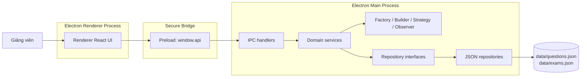

## 2. Luồng khởi động ứng dụng

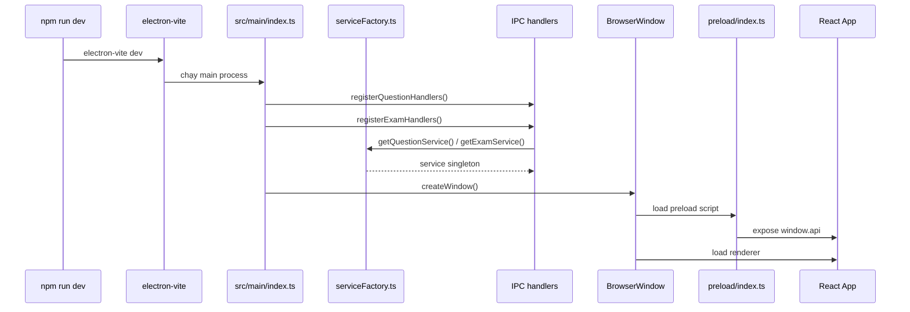

## 3. Luồng tạo câu hỏi

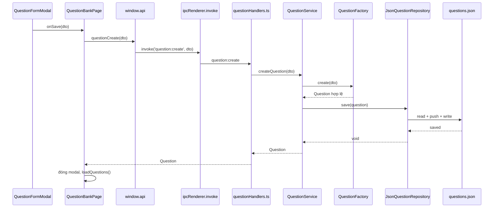

## 4. Logic validate khi tạo câu hỏi

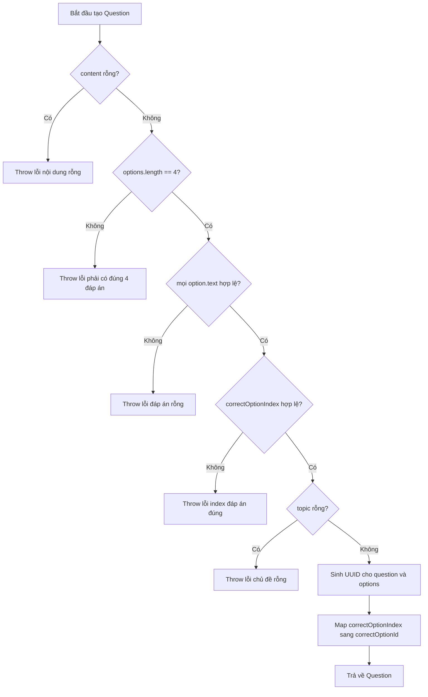

## 5. Luồng cập nhật câu hỏi

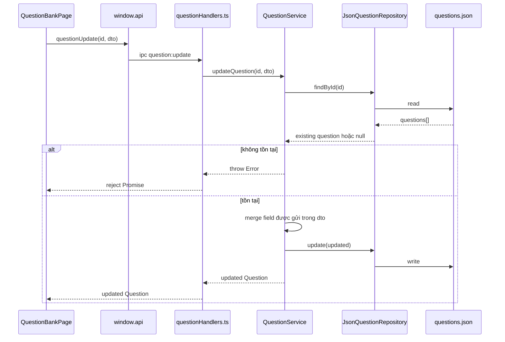

## 6. Luồng tạo đề thi

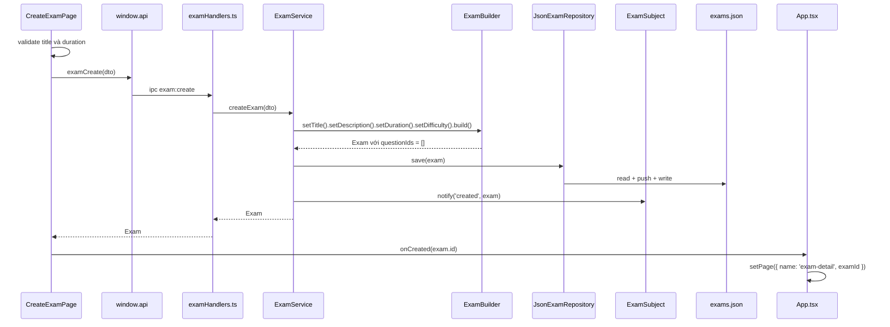

## 7. Logic validate khi tạo đề

```mermaid
flowchart TD
  Start[Bắt đầu tạo Exam] --> Title{title rỗng?}
  Title -- Có --> ErrTitle[Throw lỗi tên đề thi rỗng]
  Title -- Không --> Duration{duration > 0?}
  Duration -- Không --> ErrDuration[Throw lỗi thời gian không hợp lệ]
  Duration -- Có --> Create[Tạo Exam]
  Create --> EmptyQuestions[questionIds = []]
  EmptyQuestions --> Reset[Reset state của Builder]
  Reset --> Return[Trả về Exam]
```

## 8. Luồng thêm câu hỏi vào đề thi

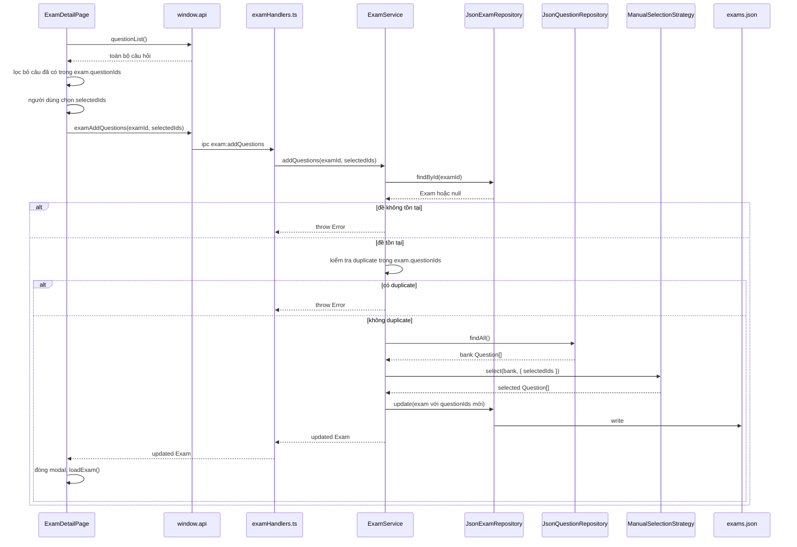

## 9. Decision flow khi thêm câu hỏi vào đề

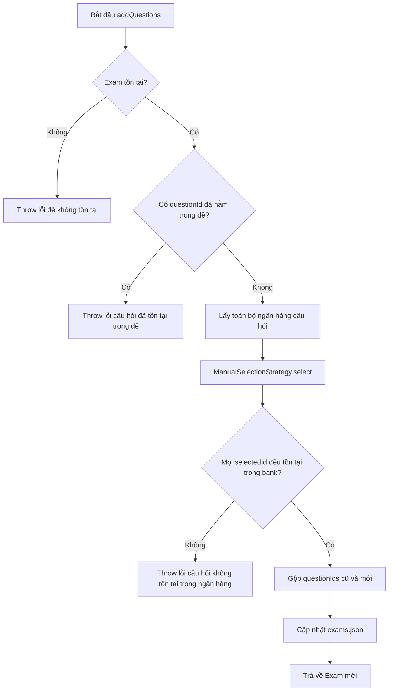

## 10. Luồng xem chi tiết đề thi

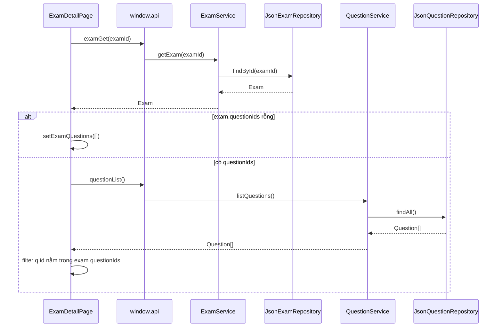

## 11. Luồng xóa dữ liệu

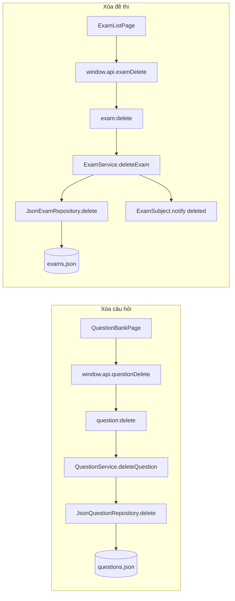

Lưu ý: xóa câu hỏi không tự xóa id câu hỏi đó khỏi `questionIds` trong các đề thi.

## 12. Sơ đồ tầng file

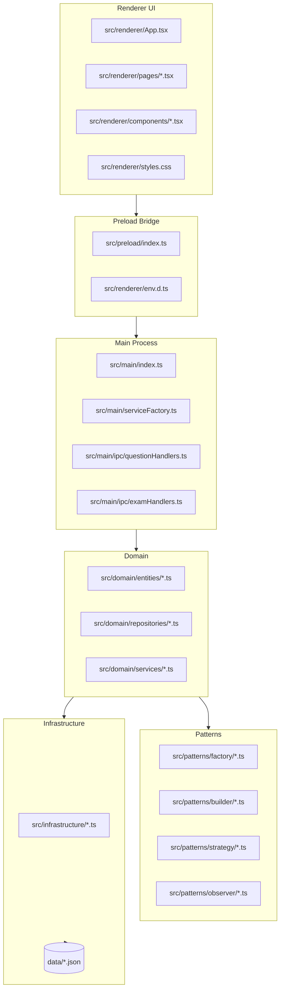

## 13. Class dependency map

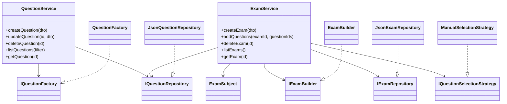

## 14. Vòng đời dữ liệu trong JSON repository

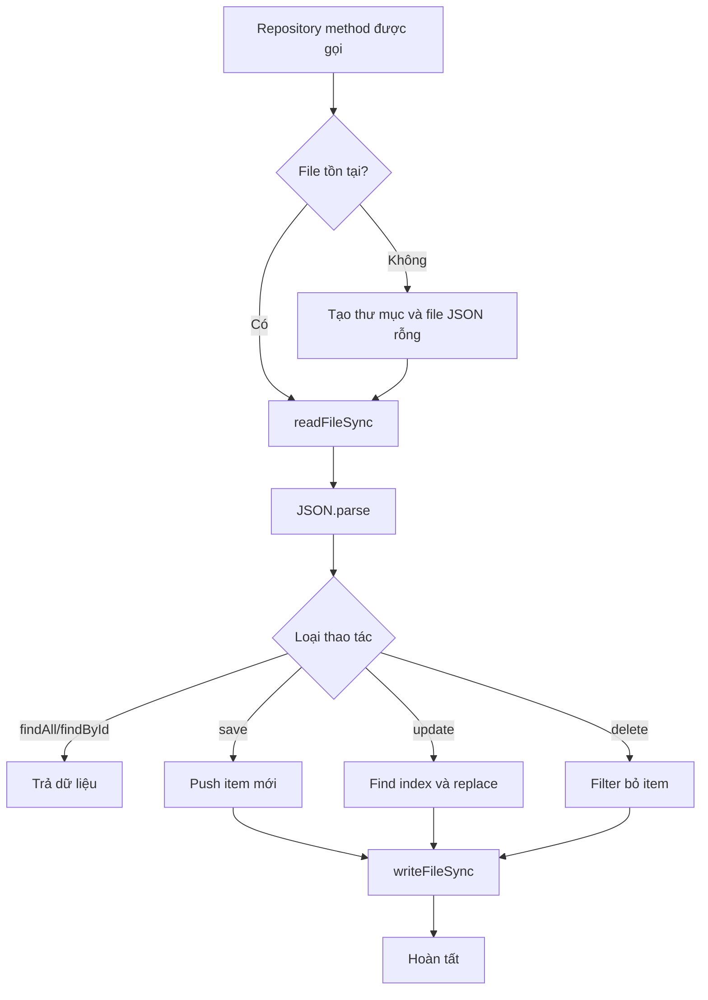

## 15. Checklist khi thêm một nghiệp vụ mới

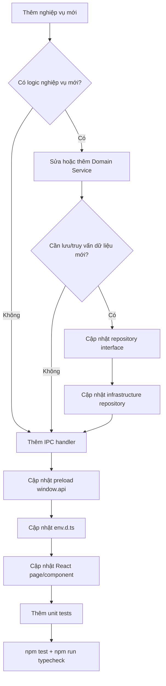
